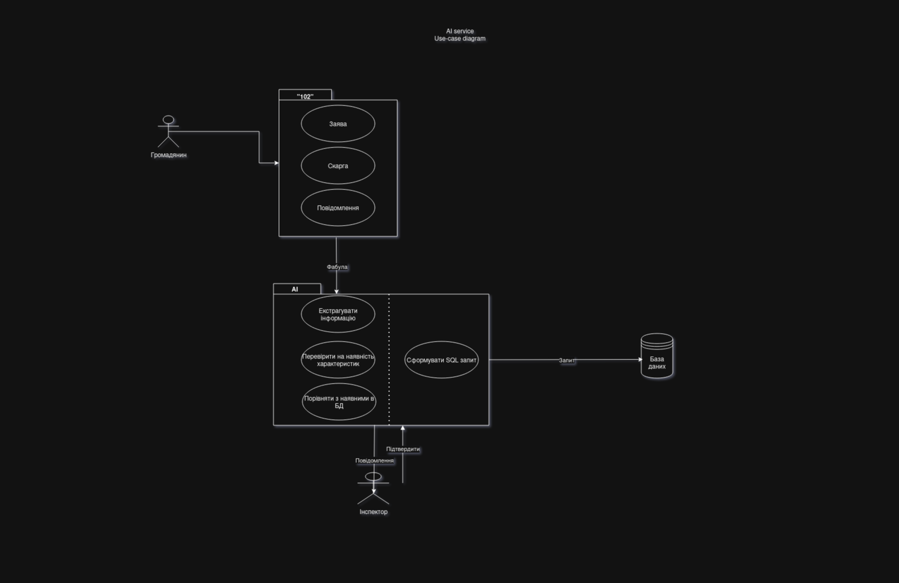

###  Деякі питання, відповіді на які мають бути надані
##### 1. Які технології використовує проект?
**Технічний стек:**
* **Бекенд:** FastAPI
* **Основа для NLP:** Нейронні мережі (Hugging Face Transformers)

* **Контейнеризація:** Docker

* **CI/CD:** Планується самохостинговий ранер (можливо, GitHub Actions Self-Hosted Runner), якщо проект буде локальним. Поки обмежуємось docker repo

* **Дані:** Наразі в доступі 1500 ручно аннотованих даних

**Доступні ресурси:**

* **Сервер (для розробки та CI/CD ранера):** 12 ядер CPU, 48 ГБ RAM, GPU NVIDIA RTX 3060 Ti (12 ГБ VRAM).

* **Людські ресурси:** 8 робочих годин на день, 5 днів на тиждень (один розробник). 

**Основне бачення проекту:**
*Головна задумка проекту продемонстрована на діаграмі екторів нижче:*

**Підсумовуючи моє бачення:**
-  Програма(**вона ж API** в нашому випадку) приймає на вхід якусь текстову інформацію з описом повідомлення що надходять на **102**
- Проводить "аналітичну роботу", тобто виокремлює сутності, які нас цікавлять в тій чи іншій **Інформаційній системі**
- Виводить отримані дані користувачеві на екран
- **КОРИСТУВАЧ** вирішує які значення запушити в БД, а які екстраговані неправильно
- Якщо все корректно і **КОРИСТУВАЧ** згоден - запис пушиться в БД

**Пайплайн проекту**
*Нижче наведено попередні припущення з приводу вигляду внутрішньої структури проекту:*

.png)
**Етапи виконання проекту:**
- Зважаючи на відсутність технічної кількості обробляти багато записів LLM моделями для їхньої розмітки розробка займе певний час
- Зівжвючи на тимчасові обмеженя - проект розробляється у вигляді **MVP** для отримання подальшого фінансування(більшої кількості відеокарт, підняття зарплати, тощо)

